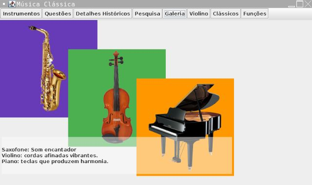
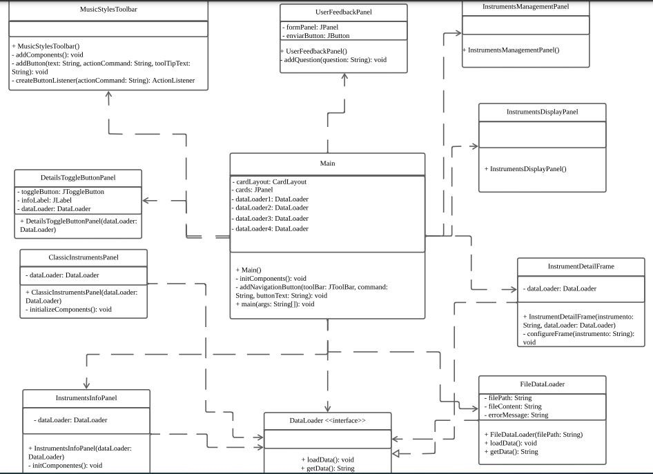

## Trabalho Final de Programação Orientada a Objetos

O tema do trabalho foi sobre Música Clássica e seus Instrumentos Típicos, abordando raízes, influências e relações entre estilos.

O projeto inclui os seguintes componentes:

01. Toggle Button
02. Text Areas
03. Tools Bar
04. Scroll Panes
05. CardLayout
06. Cell Editor
07. Buttons + Tools Bar
08. Layered Panes
09. Internal Frames
10. GridBagLayout

### Arquitetura do Aplicativo

O aplicativo foi construído com base no modelo de componentes Swing, seguindo as melhores práticas de programação orientada a objetos. A arquitetura do aplicativo foi projetada para ser modular, facilitando atualizações, onde foi utilizado Interface para a facilitar manutenções futuras.

### Requisitos:

- Incluir os 10 Componentes propostos
- Construir uma Interface Intuiva com o tema proposto, gerenciando todos os componentes
- Interface ou Classes Abstratas
- Herança
- Polimorfismo
- Arquivos
- Tratamento de Exceção

# Tecnologias Utilizadas:

- Java

### Gerenciamento de Dados

- **DataLoader Interface**: Define um contrato para classes que carregam dados, permitindo o uso polimórfico de diferentes fontes de dados.
- **FileDataLoader**: Uma implementação concreta de DataLoader que lê dados de arquivos de texto, exemplificando o uso de herança e polimorfismo.

### Princípios de Orientação a Objetos

- **Herança**: Todas as classes de painéis herdam de JPanel ou JInternalFrame, demonstrando a reutilização de funcionalidades providas pelo Swing.
- **Polimorfismo**: Através da interface DataLoader, diferentes painéis como InstrumentsInfoPanel, DetailsToggleButtonPanel, InstrumentDetailFrame e ClassicInstrumentsPanel podem interagir com várias formas de dados (por exemplo, arquivos ou APIs) sem alterações significativas no código dos painéis.

### Deploy

[Link Deploy](https://replit.com/@NathanMota1/TrabalhoFinalPOO?v=1)

### Licença
Este projeto está licenciado sob a Licença MIT.